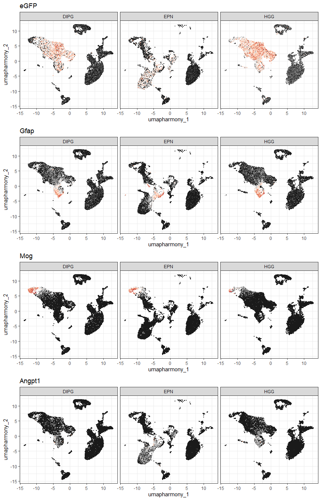
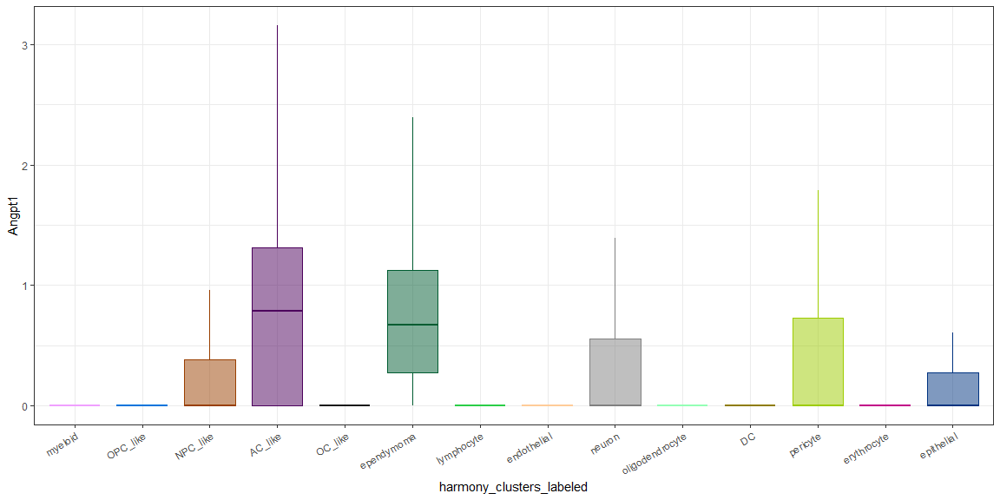

***
# Angpt1 plots
### Test plots for Angpt1 project
This is a working document -- updates to code can be pushed in real time for easy viewing.


### UMAP plot showing scGPT-based annotations


Cluster annotations based on a large language model.
<!-- -->

***
### UMAP plots demonstrating expression
Gfap is a marker used by [Filbin *et al*](https://doi.org/10.1038/s41588-022-01236-3) for AC-like tumor cells.
<!-- -->

Alternate color scheme
<!-- -->

***
### Boxplots
All cell types

<!-- -->


Limited to tumor cells only

<!-- -->


Adding points

<!-- -->

***
### Violin plots
Tumor cells only
<!-- -->

Adding points
<!-- -->


### Density plots
<!-- -->


``` r
sessionInfo()
```

```
## R version 4.4.2 (2024-10-31 ucrt)
## Platform: x86_64-w64-mingw32/x64
## Running under: Windows 11 x64 (build 22631)
## 
## Matrix products: default
## 
## 
## locale:
## [1] LC_COLLATE=English_United States.utf8 
## [2] LC_CTYPE=English_United States.utf8   
## [3] LC_MONETARY=English_United States.utf8
## [4] LC_NUMERIC=C                          
## [5] LC_TIME=English_United States.utf8    
## 
## time zone: America/New_York
## tzcode source: internal
## 
## attached base packages:
## [1] stats     graphics  grDevices utils     datasets  methods   base     
## 
## other attached packages:
##  [1] RColorBrewer_1.1-3 ggthemes_5.1.0     cowplot_1.1.3      lubridate_1.9.4   
##  [5] forcats_1.0.0      stringr_1.5.1      dplyr_1.1.4        purrr_1.0.2       
##  [9] readr_2.1.5        tidyr_1.3.1        tibble_3.2.1       ggplot2_3.5.1     
## [13] tidyverse_2.0.0    Seurat_5.1.0       SeuratObject_5.0.2 sp_2.1-4          
## 
## loaded via a namespace (and not attached):
##   [1] rstudioapi_0.17.1      jsonlite_1.8.9         magrittr_2.0.3        
##   [4] spatstat.utils_3.1-2   farver_2.1.2           rmarkdown_2.29        
##   [7] vctrs_0.6.5            ROCR_1.0-11            spatstat.explore_3.3-4
##  [10] htmltools_0.5.8.1      sass_0.4.9             sctransform_0.4.1     
##  [13] parallelly_1.41.0      KernSmooth_2.23-26     bslib_0.9.0           
##  [16] htmlwidgets_1.6.4      ica_1.0-3              plyr_1.8.9            
##  [19] plotly_4.10.4          zoo_1.8-12             cachem_1.1.0          
##  [22] igraph_2.1.3           mime_0.12              lifecycle_1.0.4       
##  [25] pkgconfig_2.0.3        Matrix_1.7-1           R6_2.6.1              
##  [28] fastmap_1.2.0          fitdistrplus_1.2-2     future_1.34.0         
##  [31] shiny_1.10.0           digest_0.6.37          colorspace_2.1-1      
##  [34] patchwork_1.3.0        tensor_1.5             RSpectra_0.16-2       
##  [37] irlba_2.3.5.1          labeling_0.4.3         progressr_0.15.1      
##  [40] spatstat.sparse_3.1-0  timechange_0.3.0       httr_1.4.7            
##  [43] polyclip_1.10-7        abind_1.4-8            compiler_4.4.2        
##  [46] withr_3.0.2            fastDummies_1.7.5      MASS_7.3-64           
##  [49] tools_4.4.2            lmtest_0.9-40          httpuv_1.6.15         
##  [52] future.apply_1.11.3    goftest_1.2-3          glue_1.8.0            
##  [55] nlme_3.1-166           promises_1.3.2         grid_4.4.2            
##  [58] Rtsne_0.17             cluster_2.1.8          reshape2_1.4.4        
##  [61] generics_0.1.3         isoband_0.2.7          gtable_0.3.6          
##  [64] spatstat.data_3.1-4    tzdb_0.4.0             data.table_1.16.4     
##  [67] hms_1.1.3              spatstat.geom_3.3-4    RcppAnnoy_0.0.22      
##  [70] ggrepel_0.9.6          RANN_2.6.2             pillar_1.10.1         
##  [73] spam_2.11-0            RcppHNSW_0.6.0         later_1.4.1           
##  [76] splines_4.4.2          lattice_0.22-6         survival_3.8-3        
##  [79] deldir_2.0-4           tidyselect_1.2.1       miniUI_0.1.1.1        
##  [82] pbapply_1.7-2          knitr_1.49             gridExtra_2.3         
##  [85] scattermore_1.2        xfun_0.50              matrixStats_1.5.0     
##  [88] stringi_1.8.4          lazyeval_0.2.2         yaml_2.3.10           
##  [91] evaluate_1.0.3         codetools_0.2-20       cli_3.6.3             
##  [94] uwot_0.2.2             xtable_1.8-4           reticulate_1.40.0     
##  [97] munsell_0.5.1          jquerylib_0.1.4        Rcpp_1.0.13-1         
## [100] globals_0.16.3         spatstat.random_3.3-2  png_0.1-8             
## [103] spatstat.univar_3.1-1  parallel_4.4.2         dotCall64_1.2         
## [106] listenv_0.9.1          viridisLite_0.4.2      scales_1.3.0          
## [109] ggridges_0.5.6         leiden_0.4.3.1         rlang_1.1.4
```
