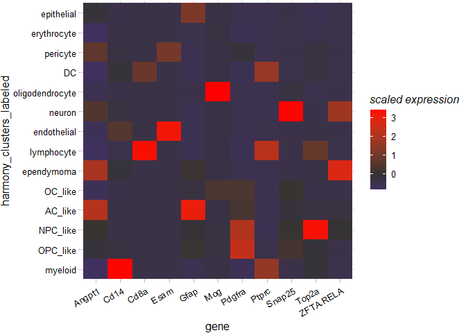

***
# Test plots for Angpt1 project
This is a working document -- updates to code can be pushed in real time for easy viewing.

## UMAP plots 
### scGPT/LLM based annotations

### UMAP of clusters plus UMAP of tumors
<!-- -->

### UMAP of clusters by tumor type - supplemental plus frequency plot
<!-- -->

### UMAP plots demonstrating expression
Gfap is a marker used by [Filbin *et al*](https://doi.org/10.1038/s41588-022-01236-3) for AC-like tumor cells, Mog for oligodendrocytes.

##### Alternate color scheme - use FeaturePlot color scheme
<!-- -->

#### FeaturePlot style
<!-- -->

***
## Bar plots 
### Cell type frequency
<!-- -->

***
## Boxplots
### All cell types

### Limited to tumor cells only

### Adding points

<!-- -->

***
## Violin plots
### All cells

### Tumor cells only

### Adding points - split into tumor/non-tumor
<!-- -->

***
## Heatmap
### By cell

### By cluster
#### Scaled - restrict to just tumor clusters for main figure; can have all for supplemental
<!-- -->

#### Midpoint 0
<!-- -->

***
## Density plots

Built with R 4.4.3.
