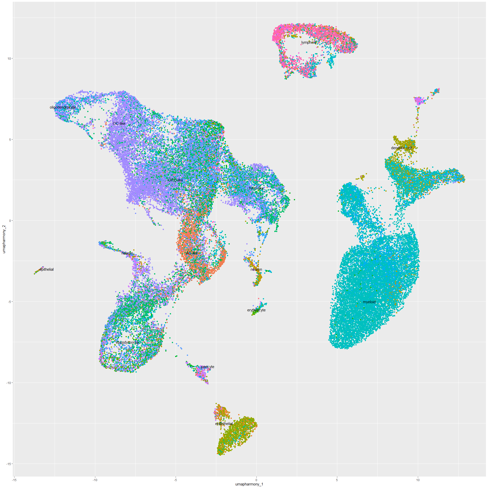
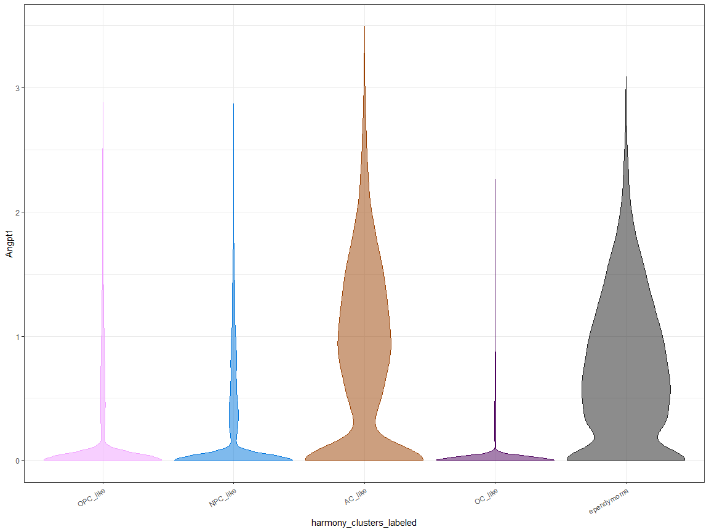
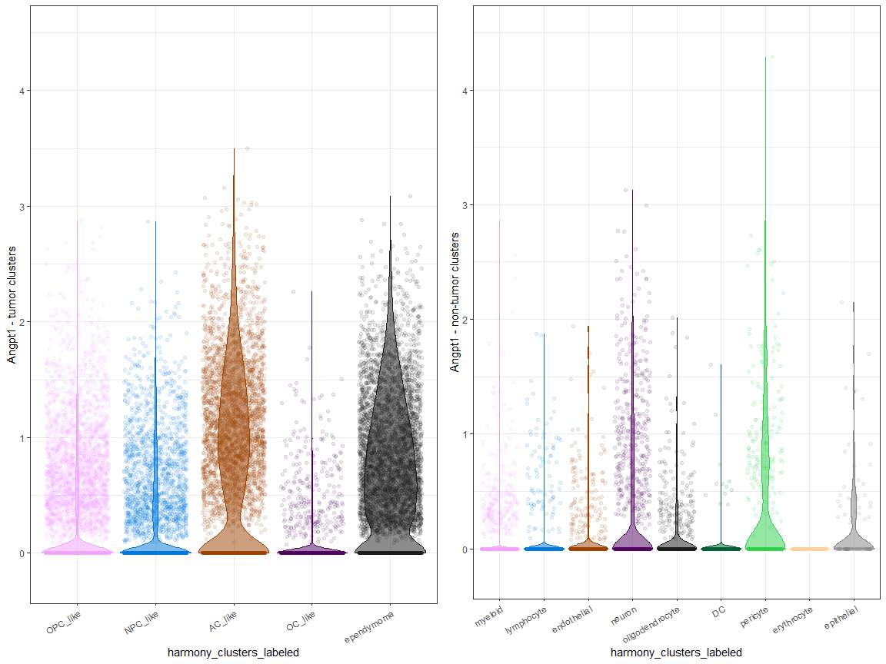
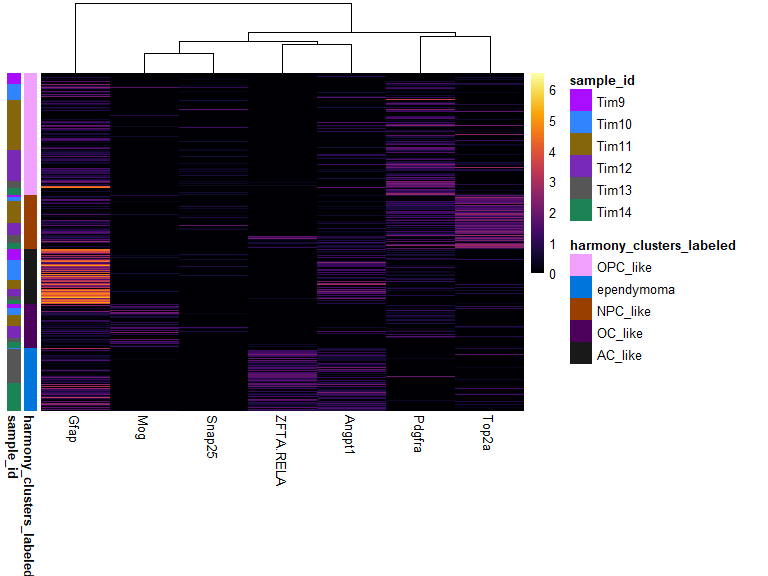

***
# Test plots for Angpt1 project
This is a working document -- updates to code can be pushed in real time for easy viewing.

## UMAP plots 
### scGPT/LLM based annotations
<!-- -->

### Annotations of Louvain clustering based on LLM labels.
<!-- -->

### UMAP plots demonstrating expression
Gfap is a marker used by [Filbin *et al*](https://doi.org/10.1038/s41588-022-01236-3) for AC-like tumor cells, Mog for oligodendrocytes.
<!-- -->

##### Alternate color scheme
<!-- -->

***
## Boxplots
### All cell types

<!-- -->

### Limited to tumor cells only

<!-- -->

### Adding points

<!-- -->

***
## Violin plots
### Tumor cells only
<!-- -->

### Adding points
<!-- -->

***
## Heatmap

<!-- -->

***
## Density plots
<!-- -->

Built with R 4.4.2.
