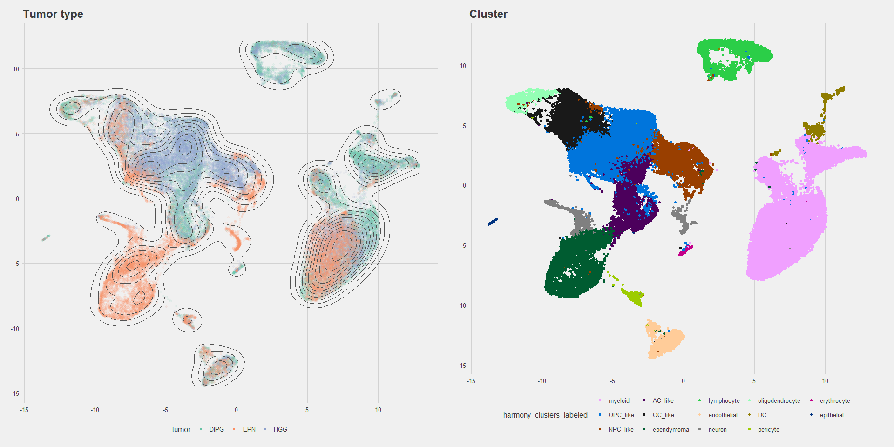
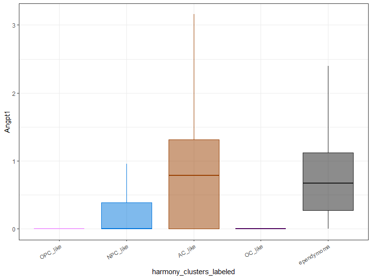
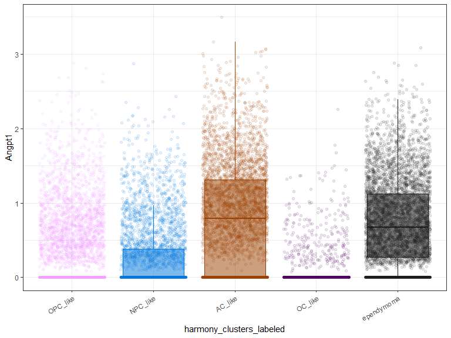

***
# Angpt1 plots
### Test plots for Angpt1 project
This is a working document -- updates to code can be pushed in real time for easy viewing.


### UMAP plot showing scGPT-based annotations


Cluster annotations based on a large language model.
<!-- -->

***
### UMAP plots demonstrating expression
Gfap is a marker used by [Filbin *et al*](https://doi.org/10.1038/s41588-022-01236-3) for AC-like tumor cells.
<!-- -->


***
### Boxplots
All cell types
<!-- -->

Limited to tumor cells only
<!-- -->

Adding points
<!-- -->

***
### Violin plots
Tumor cells only
<!-- -->

Adding points
<!-- -->


``` r
sessionInfo()
```

```
## R version 4.4.2 (2024-10-31 ucrt)
## Platform: x86_64-w64-mingw32/x64
## Running under: Windows 11 x64 (build 22631)
## 
## Matrix products: default
## 
## 
## locale:
## [1] LC_COLLATE=English_United States.utf8 
## [2] LC_CTYPE=English_United States.utf8   
## [3] LC_MONETARY=English_United States.utf8
## [4] LC_NUMERIC=C                          
## [5] LC_TIME=English_United States.utf8    
## 
## time zone: America/New_York
## tzcode source: internal
## 
## attached base packages:
## [1] stats     graphics  grDevices utils     datasets  methods   base     
## 
## other attached packages:
##  [1] RColorBrewer_1.1-3 ggthemes_5.1.0     cowplot_1.1.3      lubridate_1.9.4   
##  [5] forcats_1.0.0      stringr_1.5.1      dplyr_1.1.4        purrr_1.0.2       
##  [9] readr_2.1.5        tidyr_1.3.1        tibble_3.2.1       ggplot2_3.5.1     
## [13] tidyverse_2.0.0    Seurat_5.1.0       SeuratObject_5.0.2 sp_2.1-4          
## 
## loaded via a namespace (and not attached):
##   [1] deldir_2.0-4           pbapply_1.7-2          gridExtra_2.3         
##   [4] rlang_1.1.4            magrittr_2.0.3         RcppAnnoy_0.0.22      
##   [7] spatstat.geom_3.3-4    matrixStats_1.5.0      ggridges_0.5.6        
##  [10] compiler_4.4.2         png_0.1-8              vctrs_0.6.5           
##  [13] reshape2_1.4.4         pkgconfig_2.0.3        fastmap_1.2.0         
##  [16] labeling_0.4.3         promises_1.3.2         rmarkdown_2.29        
##  [19] tzdb_0.4.0             xfun_0.50              cachem_1.1.0          
##  [22] jsonlite_1.8.9         goftest_1.2-3          later_1.4.1           
##  [25] spatstat.utils_3.1-2   irlba_2.3.5.1          parallel_4.4.2        
##  [28] cluster_2.1.8          R6_2.6.1               ica_1.0-3             
##  [31] spatstat.data_3.1-4    bslib_0.9.0            stringi_1.8.4         
##  [34] reticulate_1.40.0      spatstat.univar_3.1-1  parallelly_1.41.0     
##  [37] lmtest_0.9-40          jquerylib_0.1.4        scattermore_1.2       
##  [40] Rcpp_1.0.13-1          knitr_1.49             tensor_1.5            
##  [43] future.apply_1.11.3    zoo_1.8-12             sctransform_0.4.1     
##  [46] timechange_0.3.0       httpuv_1.6.15          Matrix_1.7-1          
##  [49] splines_4.4.2          igraph_2.1.3           tidyselect_1.2.1      
##  [52] abind_1.4-8            rstudioapi_0.17.1      yaml_2.3.10           
##  [55] spatstat.random_3.3-2  codetools_0.2-20       miniUI_0.1.1.1        
##  [58] spatstat.explore_3.3-4 listenv_0.9.1          lattice_0.22-6        
##  [61] plyr_1.8.9             withr_3.0.2            shiny_1.10.0          
##  [64] ROCR_1.0-11            evaluate_1.0.3         Rtsne_0.17            
##  [67] future_1.34.0          fastDummies_1.7.5      survival_3.8-3        
##  [70] polyclip_1.10-7        fitdistrplus_1.2-2     pillar_1.10.1         
##  [73] KernSmooth_2.23-26     plotly_4.10.4          generics_0.1.3        
##  [76] RcppHNSW_0.6.0         hms_1.1.3              munsell_0.5.1         
##  [79] scales_1.3.0           globals_0.16.3         xtable_1.8-4          
##  [82] glue_1.8.0             lazyeval_0.2.2         tools_4.4.2           
##  [85] data.table_1.16.4      RSpectra_0.16-2        RANN_2.6.2            
##  [88] leiden_0.4.3.1         dotCall64_1.2          grid_4.4.2            
##  [91] colorspace_2.1-1       nlme_3.1-166           patchwork_1.3.0       
##  [94] cli_3.6.3              spatstat.sparse_3.1-0  spam_2.11-0           
##  [97] viridisLite_0.4.2      uwot_0.2.2             gtable_0.3.6          
## [100] sass_0.4.9             digest_0.6.37          progressr_0.15.1      
## [103] ggrepel_0.9.6          htmlwidgets_1.6.4      farver_2.1.2          
## [106] htmltools_0.5.8.1      lifecycle_1.0.4        httr_1.4.7            
## [109] mime_0.12              MASS_7.3-64
```
